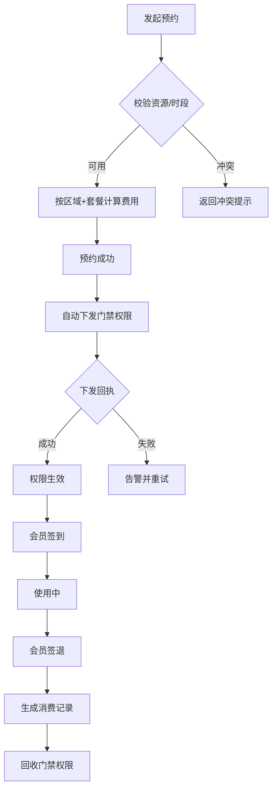

# 自习室 / 共享空间管理系统 — 产品需求文档（PRD）

## 1. 产品概述
本系统为自习室与共享空间运营方提供一站式数字化管理平台，覆盖「座位/房间资源 → 时段预约 → 门禁权限下发 → 签到签退 → 消费记录」全链路。目标用户为空间运营者与前台人员，核心价值在于将分散的人工登记流程整合为一套可视、可追溯、可计费的运营系统，提升空间利用率与营收透明度。

## 2. 核心功能

### 2.1 用户角色
| 角色 | 登录方式 | 核心权限 |
|------|---------|---------|
| 运营管理员 | 账号密码 | 全部模块管理、区域定价配置、门禁权限管理、数据导出 |
| 前台人员 | 账号密码 | 预约受理、签到签退、消费记录查看、开门补发 |
| 会员（数据对象） | 系统登记 | 作为预约/消费主体被管理，不直接登录后台 |

### 2.2 功能模块
1. **数据概览**：关键指标卡、今日预约时间轴、座位利用率、近 7 天营收趋势
2. **座位/房间管理**：分区平面图可视化、区域差异化定价、资源台账与状态切换
3. **预约管理**：新建预约（按小时/天卡/月卡/次卡）、日历视图、预约列表与状态流转
4. **签到签退**：实时在场看板、一键签到/签退、迟到/早退/超时标记
5. **消费记录**：账单流水、套餐核销记录、按区域/套餐维度收入统计
6. **门禁联动**：预约成功自动下发开门权限、下发状态回执、开门记录与异常告警

### 2.3 页面详情
| 页面名称 | 模块名称 | 功能描述 |
|---------|---------|---------|
| 数据概览 | 指标卡 | 今日营收、当前在场人数、整体利用率、待签到预约数 |
| 数据概览 | 今日时间轴 | 今日预约按小时分布的横向条带图 |
| 数据概览 | 营收趋势 | 近 7 天营收折线图 |
| 座位/房间管理 | 分区平面图 | 网格化展示各区域座位/房间布局与实时状态色块 |
| 座位/房间管理 | 区域定价 | 开放区/隔间/研讨室四种套餐价格配置 |
| 座位/房间管理 | 资源列表 | 座位/房间台账、启用/停用/维护状态切换 |
| 预约管理 | 新建预约 | 分步：选区域 → 选资源 → 选套餐 → 选时段 → 确认（含门禁下发预览） |
| 预约管理 | 日历视图 | 按日查看资源占用甘特条 |
| 预约管理 | 预约列表 | 按状态/区域/会员筛选、搜索、取消/核销 |
| 签到签退 | 在场看板 | 当前在场人员实时列表与使用时长进度 |
| 签到签退 | 操作区 | 一键签到/签退、迟到/超时标记与补费提示 |
| 消费记录 | 账单流水 | 消费明细、套餐核销、支付方式 |
| 消费记录 | 收入统计 | 按区域/套餐维度的收入对比 |
| 门禁联动 | 权限下发 | 预约成功自动生成并下发门禁令牌，显示下发状态 |
| 门禁联动 | 开门记录 | 闸机开门日志时间线、异常告警 |

## 3. 核心流程

### 3.1 预约到门禁全流程
会员/前台发起预约 → 系统校验资源可用性与时段冲突 → 按区域+套餐计算费用 → 预约成功 → 自动下发门禁权限（绑定资源 ID + 起止时段）→ 会员在时段内签到 → 使用结束签退 → 自动生成消费记录。

### 3.2 签到签退流程
预约时段开始前/内会员到店 → 前台或自助签到 → 系统记录签到时间并校验门禁权限有效性 → 时段结束前签退 → 计算实际使用时长 → 若超时则按小时单价补费并写入账单。

### 3.3 门禁联动流程
预约成功 → 生成门禁令牌（资源 ID + 起止时间）→ 下发至对应区域闸机 → 回执状态（成功/失败，失败自动重试并告警）→ 时段结束自动回收权限 → 全程记录开门日志。

## 4. 用户界面设计

### 4.1 设计风格
- **主题方向**：当代书斋（Modern Atelier）—— 暖米白纸张底色 + 墨黑主文字 + 琥珀橙强调色 + 深苔绿次强调色，营造沉静、专注、专业的自习室运营氛围，区别于常见冷蓝后台风格
- **主色**：背景 `#F5F1E8`（暖米白）/ 卡片 `#FFFFFF`、`#FBF7EF` / 主文字 `#211D17`（墨黑）
- **强调色**：琥珀橙 `#B45309`、深苔绿 `#3F6B5A`
- **状态色**：空闲（苔绿 `#3F6B5A`）/ 占用（琥珀 `#B45309`）/ 预约（靛青 `#3B5B8C`）/ 维护（暖灰 `#9C8E6E`）
- **边框**：`#E5DDC8`（暖灰）
- **按钮风格**：主按钮琥珀橙实心、8px 微圆角、悬停轻微下沉阴影；次按钮描边态
- **字体**：标题 Fraunces（衬线展示体，体现书卷气），正文 Hanken Grotesk（无衬线，清晰利落），数字使用等宽特性
- **布局风格**：左侧固定侧边栏 + 顶部状态栏 + 主内容卡片网格，桌面优先，留白克制而精致
- **图标**：lucide 线性图标，克制使用
- **细节**：卡片细边框 + 极浅暖色阴影、分区色条、表格斑马底纹、徽章圆角标签

### 4.2 页面设计概览
| 页面名称 | 模块名称 | UI 元素 |
|---------|---------|---------|
| 数据概览 | 指标卡 | 暖白卡片、大号 Fraunces 数字、趋势小标签 |
| 数据概览 | 营收趋势 | 自绘 SVG 折线图、琥珀渐变填充 |
| 座位/房间管理 | 平面图 | 网格化座位块、状态色、悬浮提示、区域色条 |
| 预约管理 | 新建预约 | 分步表单、区域/套餐选择卡、时段甘特条、门禁下发预览 |
| 签到签退 | 在场看板 | 在场人员列表、使用时长进度条 |
| 门禁联动 | 权限日志 | 时间线、状态徽章、开门记录条目 |

### 4.3 响应式
桌面优先（1280px+ 完整体验），平板自适应（侧边栏折叠为图标态），移动端基础可用（关键操作可达）。
