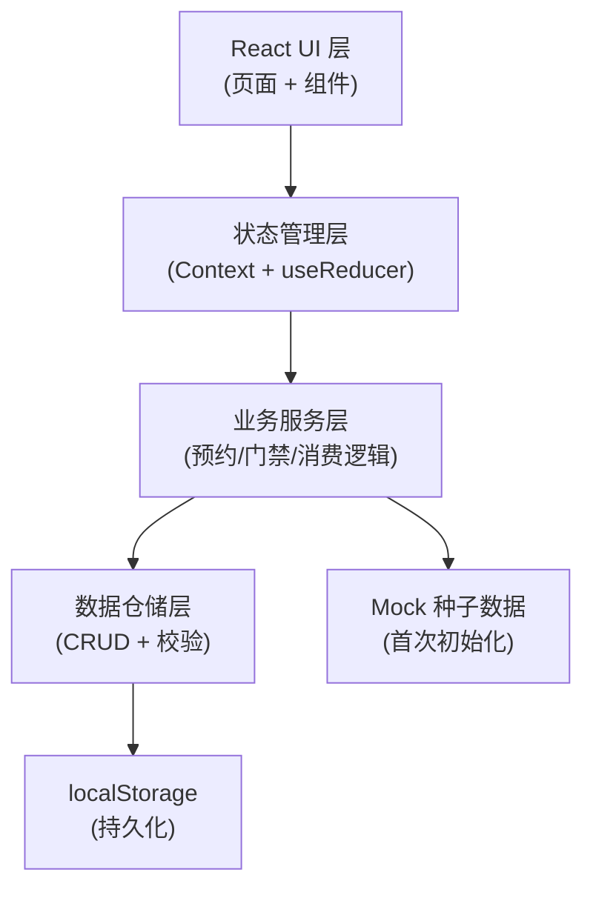
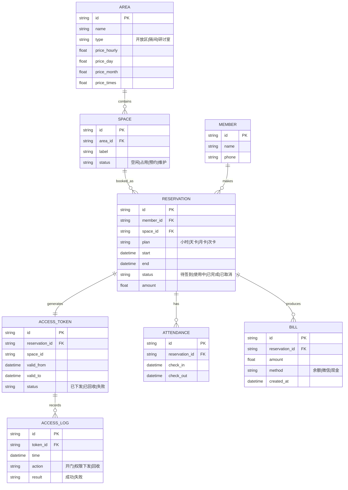

# 自习室 / 共享空间管理系统 — 技术架构文档

## 1. 架构设计
前端单页应用 + 本地化业务逻辑层（模拟后端）。采用 React Context + useReducer 管理全局状态，通过 localStorage 持久化数据，使管理操作在刷新后保留；内置 Mock 种子数据用于首屏展示。



## 2. 技术说明
- **前端**：React@18 + TypeScript + TailwindCSS@3 + Vite
- **初始化工具**：Vite（react-ts 模板）
- **路由**：React Router@6
- **图表**：自绘 SVG（营收趋势折线、时段分布条带），避免重型图表库
- **状态管理**：React Context + useReducer，配合 localStorage 持久化
- **图标**：lucide-react
- **字体**：Google Fonts（Fraunces + Hanken Grotesk）
- **后端**：无（前端模拟业务逻辑与持久化）
- **数据**：localStorage 持久化 + Mock 种子数据

## 3. 路由定义
| 路由 | 用途 |
|------|------|
| `/` | 数据概览（指标、时间轴、营收趋势） |
| `/spaces` | 座位/房间管理（平面图、定价、台账） |
| `/reservations` | 预约管理（新建、列表、状态流转） |
| `/attendance` | 签到签退（在场看板、操作） |
| `/billing` | 消费记录（账单流水、收入统计） |
| `/access` | 门禁联动（权限下发、开门记录） |

## 4. API / 业务服务定义
无真实 HTTP，业务服务以 TS 函数形式提供：

```ts
// 预约服务
createReservation(input: ReservationInput): Result<Reservation>
checkConflict(spaceId, start, end): ConflictInfo
calculateAmount(area, plan, duration): number

// 门禁服务
issueAccessToken(reservationId): AccessToken   // 预约成功自动调用
revokeAccessToken(tokenId): void                // 时段结束/取消自动调用
logAccess(tokenId, action, result): void

// 签到服务
checkIn(reservationId): Attendance
checkOut(reservationId): { bill?: Bill }

// 账单服务
createBill(reservationId, amount, method): Bill
```

## 5. 业务规则
- 区域差异化定价：开放区/隔间/研讨室各自维护四种套餐价（小时/天/月/次）
- 时段冲突校验：同一资源同一时段不可重复预约（小时/天卡按区间，次卡/月卡按额度）
- 套餐语义：
  - 小时卡：按起止区间计费
  - 天卡：当日有效
  - 月卡：生效起 30 天有效，可多次使用
  - 次卡：固定次数，每次核销一次
- 门禁权限：预约成功自动下发，绑定资源 ID + 起止时段；失败重试并告警；签退或取消后回收
- 超时补费：实际签退晚于预约结束时间，超出部分按小时单价计入账单

## 6. 数据模型

### 6.1 数据模型定义


### 6.2 数据定义（TypeScript 类型）

```ts
type AreaType = 'open' | 'booth' | 'room';
type Plan = 'hourly' | 'day' | 'month' | 'times';
type SpaceStatus = 'free' | 'occupied' | 'reserved' | 'maintenance';
type ReservationStatus = 'pending' | 'active' | 'done' | 'cancelled';
type TokenStatus = 'issued' | 'revoked' | 'failed';

interface Area {
  id: string; name: string; type: AreaType;
  price_hourly: number; price_day: number;
  price_month: number; price_times: number;
}
interface Space { id: string; area_id: string; label: string; status: SpaceStatus; }
interface Member { id: string; name: string; phone: string; }
interface Reservation {
  id: string; member_id: string; space_id: string; plan: Plan;
  start: string; end: string; status: ReservationStatus; amount: number;
}
interface AccessToken {
  id: string; reservation_id: string; space_id: string;
  valid_from: string; valid_to: string; status: TokenStatus;
}
interface Attendance { id: string; reservation_id: string; check_in: string; check_out?: string; }
interface Bill { id: string; reservation_id: string; amount: number; method: string; created_at: string; }
interface AccessLog { id: string; token_id: string; time: string; action: string; result: string; }
```
